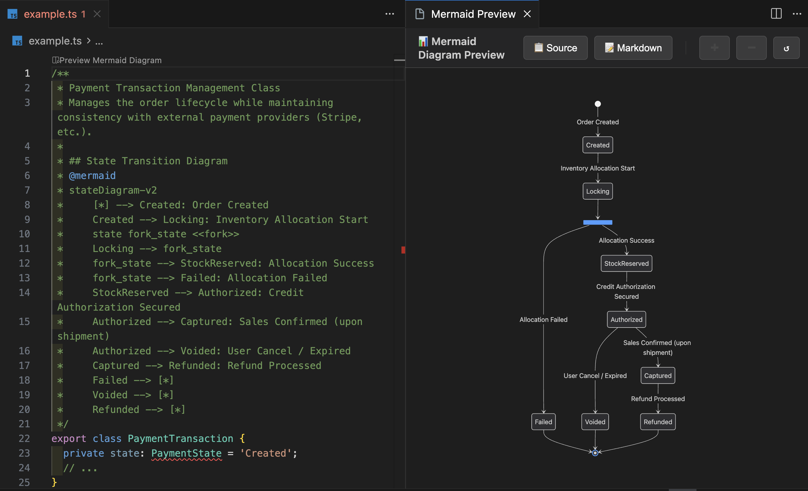

# Mermaid Comment Viewer

Visualize Mermaid diagrams directly from your code comments with CodeLens, Hover, and an interactive Preview Panel.



## Features

- **CodeLens Integration** - Click "Preview Mermaid Diagram" above any Mermaid code block in comments
- **Hover Preview** - Hover over Mermaid code to see a quick preview with formatted display
- **Interactive Preview Panel**:
  - **Full-Width View** - View diagrams in a spacious, responsive panel with modern glassmorphism UI
  - **Zoom & Pan** - Intuitively explore large diagrams with mouse wheel zoom and drag-to-pan
  - **Copy Source** - Copy raw Mermaid code to clipboard
  - **Copy Markdown** - Copy diagram with theme styling as markdown code block
- **Multi-Language Support** - Works with TypeScript, JavaScript, Python, Go, and Rust
- **Theme Support** - Automatically adapts to your VS Code theme (Light/Dark)

## Usage

### TypeScript / JavaScript

Write Mermaid code inside a comment block with the `mermaid` or `@mermaid` keyword:

```typescript
/**
 * mermaid
 * graph TD
 *     A[Start] --> B{Is it working?}
 *     B -- Yes --> C[Great!]
 *     B -- No --> D[Debug]
 */
function example() {
  // Your code here
}
```

You can also use the `@mermaid` annotation format:

```typescript
/**
 * Payment Transaction Management Class
 * Manages the order lifecycle while maintaining consistency with external payment providers (Stripe, etc.).
 *
 * ## State Transition Diagram
 * @mermaid
 * stateDiagram-v2
 *     [*] --> Created: Order Created
 *     Created --> Locking: Inventory Allocation Start
 *     state fork_state <<fork>>
 *     Locking --> fork_state
 *     fork_state --> StockReserved: Allocation Success
 *     fork_state --> Failed: Allocation Failed
 *     StockReserved --> Authorized: Credit Authorization Secured
 *     Authorized --> Captured: Sales Confirmed (upon shipment)
 *     Authorized --> Voided: User Cancel / Expired
 *     Captured --> Refunded: Refund Processed
 *     Failed --> [*]
 *     Voided --> [*]
 *     Refunded --> [*]
 */
export class PaymentTransaction {
  private state: PaymentState = 'Created';
  // ...
}
```

### Python

```python
"""
mermaid
sequenceDiagram
    Alice->>Bob: Hello
    Bob->>Alice: Hi there!
"""
def greet():
    pass
```

### Go

```go
/*
mermaid
graph LR
    A[Client] --> B[API]
    B --> C[Database]
*/
func process() {
    // Your code here
}
```

### Rust

```rust
/*
mermaid
stateDiagram-v2
    [*] --> Idle
    Idle --> Processing
    Processing --> Complete
    Complete --> [*]
*/
fn execute() {
    // Your code here
}
```

## How to Use

1. **Write Mermaid code** inside a comment block (supports `/* */`, `"""`, `#`, etc.)
2. **Click the CodeLens** "Preview Mermaid Diagram" that appears above the code
3. **Or hover** over the Mermaid code to see a quick preview
4. **Or run the command** "Mermaid: Show Preview" from the Command Palette (`Cmd+Shift+P` / `Ctrl+Shift+P`)

## Requirements

- **VS Code** 1.95.0 or higher
- **Node.js** 22.0.0 or higher (for extension development)

The extension works out of the box - no additional setup required!

## Extension Settings

This extension contributes the following settings:

* `mermaidInlineViewer.theme` - Set the Mermaid theme (default, base, dark, forest, neutral). Default: `base`
* `mermaidInlineViewer.backgroundColor` - Set the background color of the preview panel. Default: `transparent`
* `mermaidInlineViewer.fontSize` - Set the font size for the diagram. Default: `16`

## Configuration Example

```json
{
  "mermaidInlineViewer.theme": "dark",
  "mermaidInlineViewer.backgroundColor": "transparent",
  "mermaidInlineViewer.fontSize": 16
}
```

## Supported Languages

- TypeScript
- JavaScript
- Python
- Go
- Rust

## Release Notes

### 1.0.0

- Initial release of Mermaid Comment Viewer
- Support for CodeLens and Hover previews
- Interactive Preview Panel with Zoom/Pan capabilities
- Copy Source and Copy Markdown features with theme styling
- Multi-language support (TypeScript, JavaScript, Python, Go, Rust)
- Modern glassmorphism UI design
- Automatic theme adaptation (Light/Dark)

## License

MIT

## Contributing

Contributions are welcome! Please feel free to submit a Pull Request.

## Issues

If you encounter any issues or have feature requests, please file them in the [issues section](https://github.com/k-furusho/mermaid-comment-viewer/issues).
