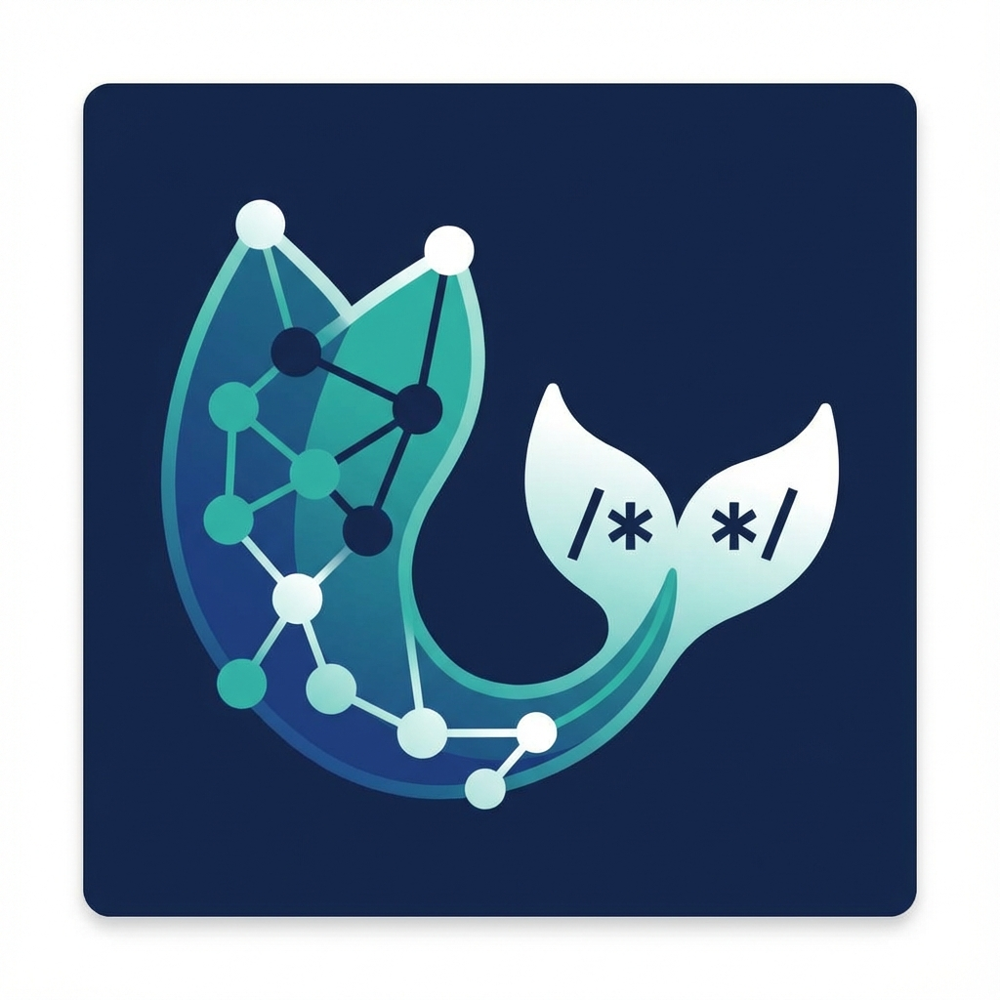

# Mermaid Comment Viewer

Visualize Mermaid diagrams directly from your code comments with CodeLens, Hover, and an interactive Preview Panel.



## Features

- **CodeLens Integration**: Click "Preview Mermaid Diagram" above any Mermaid code block in comments.
- **Hover Preview**: Hover over Mermaid code to see a quick preview with formatted display.
- **Interactive Preview Panel**:
    - **Full-Width View**: View diagrams in a spacious, responsive panel with modern glassmorphism UI.
    - **Zoom & Pan**: Intuitively explore large diagrams with mouse wheel zoom and drag-to-pan.
    - **Copy Source**: Copy raw Mermaid code to clipboard.
    - **Copy Markdown**: Copy diagram with theme styling as markdown code block.
- **Multi-Language Support**: Works with TypeScript, JavaScript, Python, Go, and Rust.
- **Theme Support**: Automatically adapts to your VS Code theme (Light/Dark).

## Usage

1. Write Mermaid code inside a comment block (supports `/* */`, `"""`, `#`, etc.).
2. Click the **Preview Mermaid Diagram** CodeLens that appears above the code.
3. Or, hover over the Mermaid code to see a quick preview.
4. Or, run the command **Mermaid: Show Preview** from the Command Palette.

### Example (TypeScript)

```typescript
/**
 * mermaid
 * graph TD
 *     A[Start] --> B{Is it working?}
 *     B -- Yes --> C[Great!]
 *     B -- No --> D[Debug]
 */
```

### Example (Python)

```python
"""
mermaid
sequenceDiagram
    Alice->>Bob: Hello
    Bob->>Alice: Hi there!
"""
```

## Extension Settings

This extension contributes the following settings:

* `mermaidInlineViewer.theme`: Set the Mermaid theme (default, base, dark, forest, neutral).
* `mermaidInlineViewer.backgroundColor`: Set the background color of the preview panel (default: transparent).
* `mermaidInlineViewer.fontSize`: Set the font size for the diagram (default: 16).

## Release Notes

### 1.0.0

- Initial release of Mermaid Comment Viewer.
- Support for CodeLens and Hover previews.
- Interactive Preview Panel with Zoom/Pan.
- Copy Source and Copy Markdown features with theme styling.
- Support for TypeScript, JavaScript, Python, Go, and Rust.
- Modern glassmorphism UI design.
